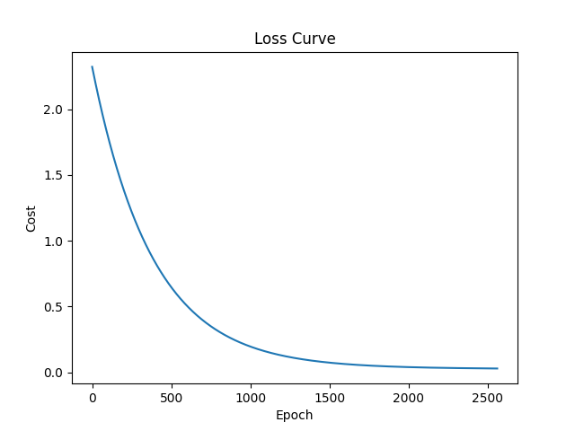
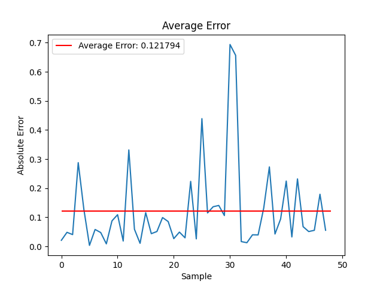

# Linear Regression from First Principles

This repository contains a basic implementation of linear regression from first principles in Python. 
The implementation includes feature improvement through minmax scaling/standardization and L2 regularization in the gradient descent function.

## Features

- Linear regression model built from first principles using gradient descent.
- Minmax feature scaling/standardization for improved model performance.
- Regularization (L2) in the gradient descent function.
- Example usage and dataset included in the repository. The Walmart dataset was used to predict the "Weekly_Sales".
- Brief exploration of the dataset can be found in notebooks/walmart_eda.ipynb.

## Getting Started

1. Clone the repository:

```bash
git clone https://github.com/your-username/linear-regression-from-scratch.git
```

2. Install the required dependencies:

```bash
pip install requirements.txt
```

3. Run the example script:

```bash
cd src
python main.py
```
#### Options:

- `--dataset_path : Path to the dataset`
- `--cols_to_drop : Columns to drop`
- `--target_col : Target column`
- `--alpha : Learning rate for gradient descent`
- `--eps : Convergence threshold for gradient descent`
- `--lambda : Regularization parameter`
- `--scaler_type : Scaler type - minmax or standardization`
- `--show_plot : Whether you want the plots to be shown`

This will train a linear regression model on a sample dataset and visualize the results.




## Contributing

Contributions are welcome! If you find any issues or have suggestions for improvements, please open an issue or submit a pull request.
